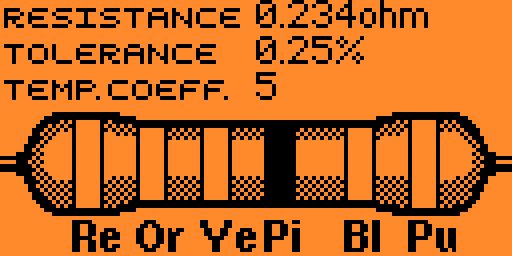

# Resistor calculator

A simple app to calculate resistor values from the coloured bands, based on original work by [Lewis Westbury](https://github.com/instantiator/flipper-zero-experimental-apps/tree/main/resistors). 

* Pick from 3, 4, 5, or 6 band resistor.
* Left and right to move the current focus, up and down to adjust the coloured bands.
* Resistance, tolerance, and temperature coefficient are updated instantly.
* This version shows friendly resistance values, supports Pink color bands, and adds three missing Temp Coefficients (+-1, +-20, +-250).



## Requirements

This app is tested against the current `dev` and `release` branches of the [OFW](https://github.com/flipperdevices/flipperzero-firmware):

* Current OFW Version: 1.2.0
<br>[](https://github.com/shalebridge/flipper-resistor-calculator/actions/workflows/build.yml)

## Build

These apps are built using [ufbt](https://pypi.org/project/ufbt/) - a subset of the flipper build tool (fbt) targeted at building apps. Install it with:

```bash
pip install ufbt
```

For build only, run `ufbt` from the terminal in the project directory. To upload, make sure Flipper is connected to your computer and run `ufbt launch`.

The directory contains the following batch script(s) to simplify the upload process:
* `win_launch.bat` - Windows only. Invokes `ufbt` to deploy and launch the app on a flipper over USB, and resets terminal colors in case of error.

Build outputs are found in the `dist` directory for each application.
